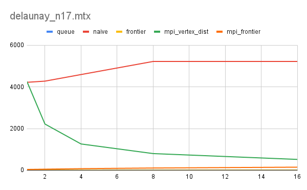
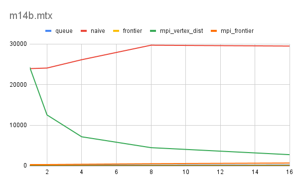
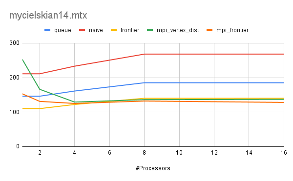
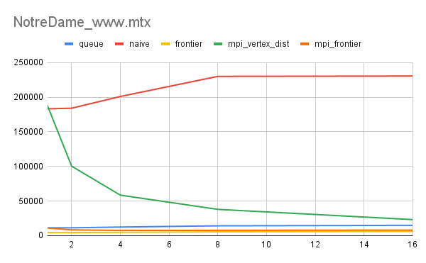
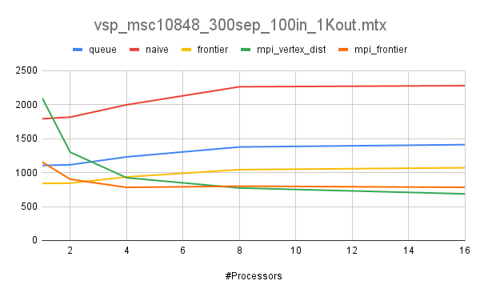

# Breadth First Search

## Hardware

Intel(R) Xeon(R) CPU E5-2695 v4 @ 2.10GHz

## Project Structure

```bash
bfs/
    graphs/                         # Contains 5 real world graphs and 1 test graph
    include/                        
        graph.h                     # Contains graph reading functions
        utils.h                     # Contains utility functions
    results/                        # Contains the results
    scripts/                        # Scripts to run     
    src/                            # Contains source code
        bfs_sequential.cpp          # Sequential implementations (queue, naive and frontier)
        graph.cpp                   # Graph operations
        main.cpp                    # Driver program
        mpi_frontier.cpp            # Frontier algorithm implementation with MPI
        mpi_vertex_dist.cpp         # Parallel version of naive implementation with MPI
        utils.cpp                   # Utility functions
```

## Build

```sh
$ git clone git@github.com:mabdullahsoyturk/bfs.git
$ cd bfs
$ make
```

## Run

Running format is: mpiexec -np <num_processors> ./bfs <graph_path> <start_vertex> <runs> <method>

### Graphs

* delaunay_n17.mtx
* m14b.mtx
* mycielskian14.mtx
* NotreDame_www.mtx
* vsp_msc10848_300sep_100in_1Kout.mtx

### Methods

* Queue (0)
* Naive (1)
* Frontier (2)
* MPI Vertex Dist (3)
* MPI Frontier (4)

If you provide start vertex as -1, it uses all vertices in the graph as the start vertex one by one.

If you don't specify the method, it will run all of them.

```sh
$ mpiexec -np 8 ../bfs ../graphs/delaunay_n17.mtx -1 10
```

## Results






